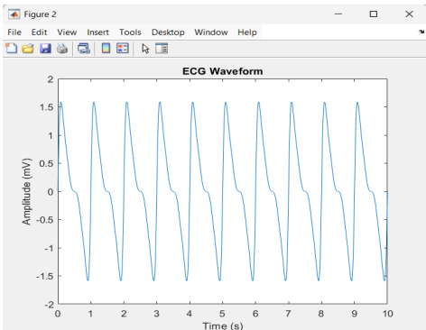
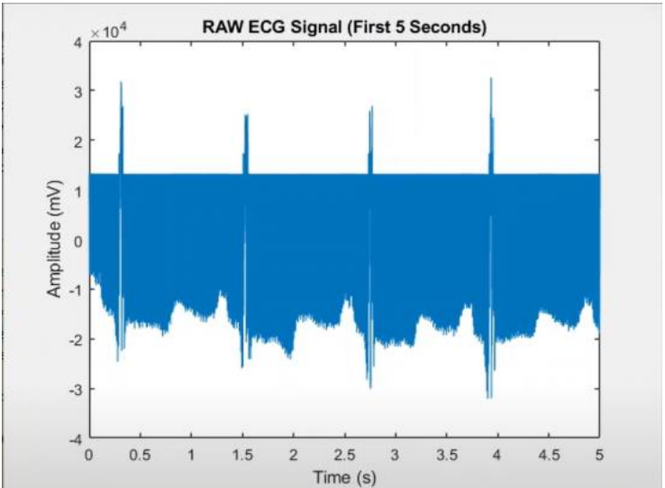
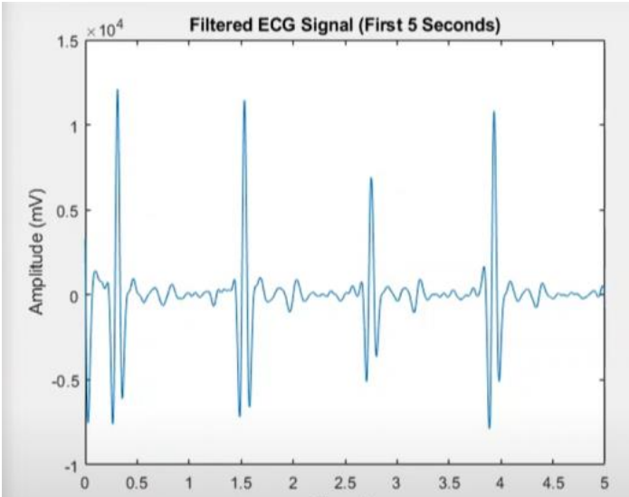
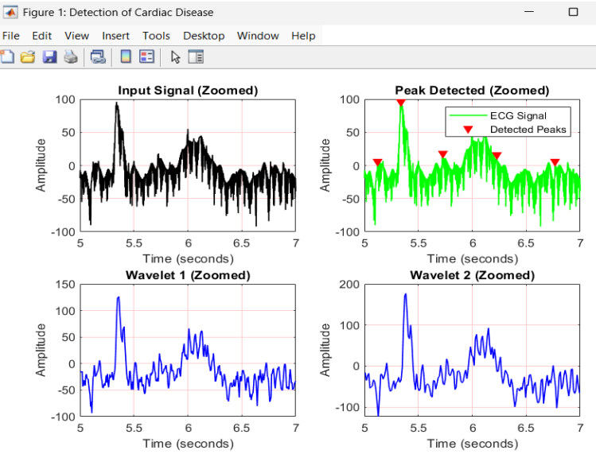
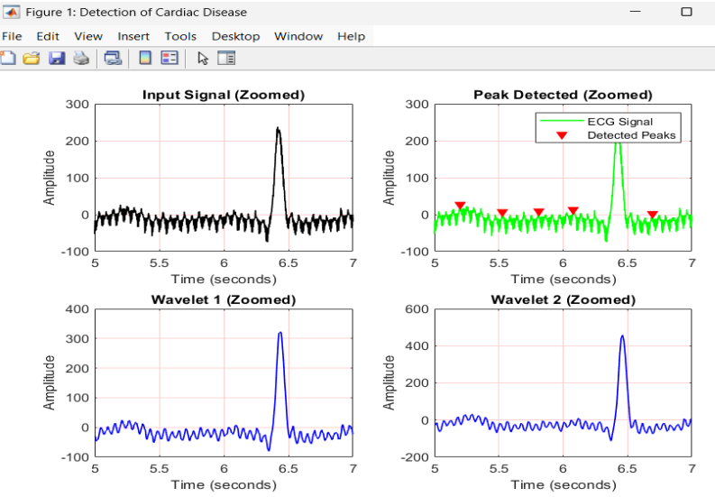
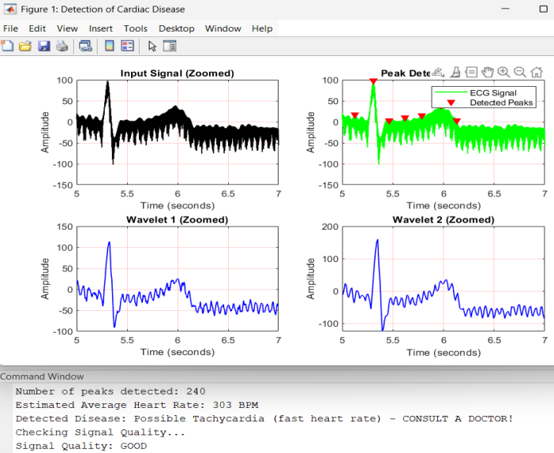

# Heart-Disease-Detection-from-ECG-Signal-Processing
MATLAB-based ECG signal analysis system for heart disease detection using bandpass filtering, R-peak detection, and wavelet decomposition.
A MATLAB-based system that reads ECG signals in standard formats, filters noise, detects R-peaks, and performs wavelet decomposition to identify potential cardiac abnormalities. The system outputs visual plots and a basic disease flag (e.g., Tachycardia) based on estimated heart rate.

## Tech Stack
| Layer | Technology |
|---|---|
| Platform | MATLAB |
| Signal Processing | Signal Processing Toolbox |
| Wavelet Analysis | Wavelet Toolbox, Daubechies-4 (db4) |
| Peak Detection | findpeaks() — MATLAB built-in |
| Data Format | PhysioNet MIT-BIH (.hea / .atr) |
| Filtering | Bandpass Filter (0.5 Hz – 40 Hz) |
| Decomposition | Discrete Wavelet Transform (DWT) — 2 levels |
| Visualization | MATLAB Plotting Functions |

## Features
- Automated ECG signal reading from .hea and .atr formats
- Bandpass filtering (0.5 Hz – 40 Hz) for noise removal
- R-peak detection using MATLAB's findpeaks() function
- Discrete Wavelet Transform (DWT) using Daubechies-4 (db4) wavelet
- 2-level wavelet decomposition (ca1 and ca2)
- Heart rate estimation from RR intervals
- Disease flagging (Tachycardia / Bradycardia / Normal)
- Signal quality assessment based on peak count
- Zoomed visualization of ECG segment (5s to 7s)
- 4-subplot output: Input Signal, Peak Detected, Wavelet 1, Wavelet 2

## Technologies Used
- MATLAB
- Signal Processing Toolbox
- Wavelet Toolbox
- Discrete Wavelet Transform (DWT)
- Daubechies-4 (db4) Wavelet
- PhysioNet ECG Data Format

## Methodology
1. Load ECG file in .hea/.atr format
2. Extract sampling frequency from header file
3. Apply bandpass filter (0.5 Hz – 40 Hz)
4. Detect R-peaks using findpeaks() with amplitude and distance thresholds
5. Apply 2-level DWT using db4 wavelet
6. Extract approximation coefficients ca1 and ca2
7. Estimate average heart rate from RR intervals
8. Flag cardiac condition based on BPM thresholds
9. Assess signal quality (< 5 peaks → poor quality)
10. Visualize results using MATLAB 4-subplot figure

## Input
- ECG signal file (.hea header + .dat/.atr data)
- Compatible with PhysioNet MIT-BIH Arrhythmia Database format

## Output
- Estimated Heart Rate (BPM)
- Disease Detection Flag (e.g., Tachycardia, Bradycardia, Normal)
- Signal Quality Assessment (GOOD / POOR)

## Results

### 1. MATLAB Simulated ECG Waveform
This figure shows the simulated ECG waveform generated in MATLAB, displaying regular cardiac cycles over a 10-second window with amplitude ranging from -2 mV to 2 mV.

  

---

### 2. RAW vs Filtered ECG Signal
The RAW ECG signal contains significant noise and baseline wander, making it difficult to identify cardiac features directly.
After applying the bandpass filter (0.5 Hz – 40 Hz), the noise is significantly reduced and the QRS complexes are clearly visible, making the signal suitable for R-peak detection and wavelet decomposition.

| RAW ECG Signal | Filtered ECG Signal |
|---|---|
|  |  |

---

### 3. Sample 1 — Cardiac Disease Detection
This figure shows the zoomed input ECG signal, detected R-peaks, and two levels of wavelet decomposition for Sample 1.
The detected peaks (red triangles) align with the QRS complex, confirming accurate heartbeat detection.

  

---

### 4. Sample 2 — Cardiac Disease Detection
This figure shows the same 4-subplot analysis for Sample 2.
The wavelet coefficients (Wavelet 1 and Wavelet 2) clearly isolate the dominant QRS peak across both decomposition levels.

  

---

### 5. Overview — Heart Disease Detection Output
This figure shows the complete MATLAB output including the 4-subplot ECG analysis along with the command window results displaying peak count, estimated heart rate, disease flag, and signal quality.

  

---

## Applications
- Automated Cardiac Monitoring
- Rural and Remote Healthcare Diagnostics
- Telemedicine and Mobile Health Systems
- Hospital ECG Screening Systems
- Wearable Health Device Integration
- Biomedical Research and Education

## Advantages
- No manual ECG interpretation required
- Fast processing using MATLAB toolboxes
- Multi-resolution signal analysis via wavelet decomposition
- Works with standard PhysioNet ECG formats
- Clear and interpretable visual outputs
- Extendable to machine learning classifiers

## Future Scope
- Integration of SVM / CNN classifiers for automated disease classification
- Validation on MIT-BIH and PhysioNet annotated datasets
- Real-time ECG processing using Arduino and ECG sensors
- Adaptive thresholding and EMD-based denoising
- MATLAB GUI or web-based interface for clinical use
- Cloud integration for remote monitoring

## Author
-H R Madalambika
- Harshita S
